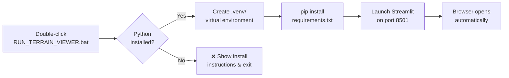
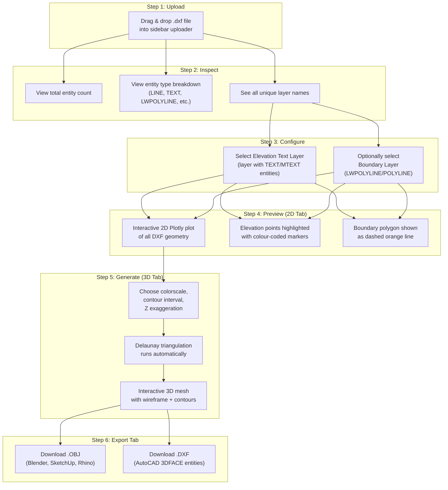
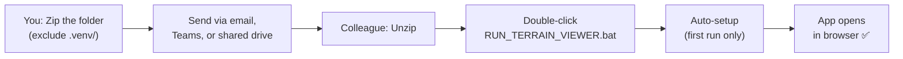

# 📋 DXF → 3D Terrain Viewer — Workspace Workflow

---

## Overview

This workspace contains a self-contained Streamlit web application that converts 2D landscape survey DXF drawings into interactive 3D terrain surfaces. The entire pipeline — from file upload to 3D export — runs locally in the user's browser.

---

## 📁 Workspace Structure

```
D01_EXCAVATION/
├── app.py                      ← Main application (all logic in one file)
├── requirements.txt            ← Python package dependencies
├── RUN_TERRAIN_VIEWER.bat      ← One-click launcher (handles setup + launch)
├── .streamlit/
│   └── config.toml             ← Streamlit dark theme configuration
├── .venv/                      ← Virtual environment (auto-created, DO NOT distribute)
└── README.md                   ← User-facing quick-start guide
```

---

## 🔄 End-to-End Workflow

### Phase 1 — Setup (First Run Only)



| Step | What Happens | Time |
|------|-------------|------|
| Python detection | Searches `python`, `py -3`, `python3`, and common install paths | Instant |
| Virtual environment | Created in `.venv/` using `python -m venv` | ~5 sec |
| Dependency install | Downloads & installs 6 packages + transitive deps | ~1–2 min |
| App launch | Streamlit starts a local web server on `http://localhost:8501` | ~3 sec |

> [!NOTE]
> On subsequent runs, the `.bat` skips venv creation and dependency installation (uses a `.deps_installed` marker file). Startup takes only ~3 seconds.

---

### Phase 2 — User Interaction Pipeline



---

### Phase 3 — Detailed Step-by-Step

#### Step 1 · File Upload
| Action | Detail |
|--------|--------|
| User drags a `.dxf` file into the sidebar uploader | Only `.dxf` extension accepted |
| File is read as raw bytes | Cached in memory for the session |
| Temporary file written to disk | Required by `ezdxf.readfile()` |
| DXF document parsed | Returns an ezdxf `Document` object |

#### Step 2 · Layer Inspection
| Action | Detail |
|--------|--------|
| Iterate all entities in ModelSpace | Extract unique `dxf.layer` values |
| Count entities by `dxftype()` | Displayed in sidebar expander |
| Populate layer dropdown menus | Sorted alphabetically |

#### Step 3 · User Configuration
| Setting | Purpose | Required? |
|---------|---------|-----------|
| **Elevation Text Layer** | Which layer contains the level annotations (TEXT/MTEXT) | ✅ Yes |
| **Boundary Layer** | Which layer has the site perimeter polyline | ❌ Optional |
| **Colorscale** | Colour mapping for elevation heatmap | Default: Earth |
| **Contour Interval** | Spacing of horizontal contour slices (metres) | Default: 0.5 |
| **Z Exaggeration** | Vertical stretch factor for visual emphasis | Default: 1.0× |
| **Show Wireframe** | Toggle triangle edge overlay | Default: On |

#### Step 4 · 2D Preview
| Element | Visual |
|---------|--------|
| Lines, polylines, arcs, circles | Grey lines on dark background |
| Points, block inserts | Small grey markers |
| All text entities | Diamond markers (hover to read) |
| **Extracted elevation points** | **Colour-coded circles with Z labels** |
| Boundary polygon | Dashed orange outline |

> The 2D preview lets the user visually confirm that the correct layer was selected and that elevation points align with the drawing before committing to the 3D mesh.

#### Step 5 · 3D Terrain Generation
| Component | Detail |
|-----------|--------|
| Mesh surface | `go.Mesh3d` with `i, j, k` triangle indices |
| Colour | Continuous elevation heatmap via `intensity` |
| Wireframe | Semi-transparent white lines along triangle edges |
| Contour lines | Yellow horizontal slices at each contour level |
| Interaction | Full zoom, pan, rotate, hover tooltips |

**Sidebar statistics updated:**
- Minimum elevation
- Maximum elevation
- Total relief (ΔZ)
- Point count
- Triangle count

#### Step 6 · Export
| Format | Use Case | Method |
|--------|----------|--------|
| `.obj` (Wavefront) | Blender, SketchUp, Rhino, 3ds Max | Vertex + face list as plain text |
| `.dxf` (3DFACE) | AutoCAD, Civil 3D, BricsCAD | `ezdxf` writes `3DFACE` entities into a new R2010 DXF |

---

## 🤝 Sharing Workflow



**Prerequisite for recipients:** Python 3.9+ installed from the **Microsoft Store** (no admin rights needed).

---

## ⚙️ Tech Stack Summary

| Layer | Library | Purpose |
|-------|---------|---------|
| GUI | Streamlit | Web-based UI, file upload, controls |
| CAD Parsing | ezdxf | Read DXF entities, layers, properties |
| Math | NumPy | Array operations on coordinate data |
| Triangulation | SciPy (Delaunay) | 2D → 3D surface mesh generation |
| Geometry | Shapely | Boundary polygon clipping |
| Visualization | Plotly | Interactive 2D and 3D charts |

---

## 🔧 Maintenance Notes

- **To reset dependencies:** Delete the `.venv` folder and re-run the `.bat`
- **To update packages:** Delete `.venv\.deps_installed`, then re-run
- **To change theme:** Edit `.streamlit/config.toml`
- **Port conflict:** If `8501` is in use, Streamlit auto-increments to `8502`, `8503`, etc.
